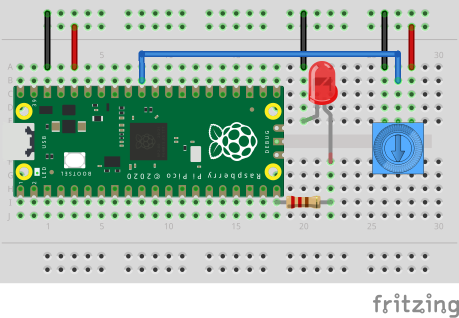

# Blinkende LED med variabel frekvens



Verdien fra `knob.value` er mellom 0 og 65535 (16-bit). I dette eksemplet deler vi den verdien med 131270 (17-bit) for å få en tidsforsinkelse mellom 0 og 0.5 sekunder.

```python
import board
import analogio
import digitalio
import time

led = digitalio.DigitalInOut(board.GP15)
led.direction = digitalio.Direction.OUTPUT
knob = analogio.AnalogIn(board.A0)

DIVIDER = 2**17

while True:
    s = knob.value / DIVIDER
    led.value = True
    time.sleep(s)
    
    s = knob.value / DIVIDER
    led.value = False
    time.sleep(s)
```
