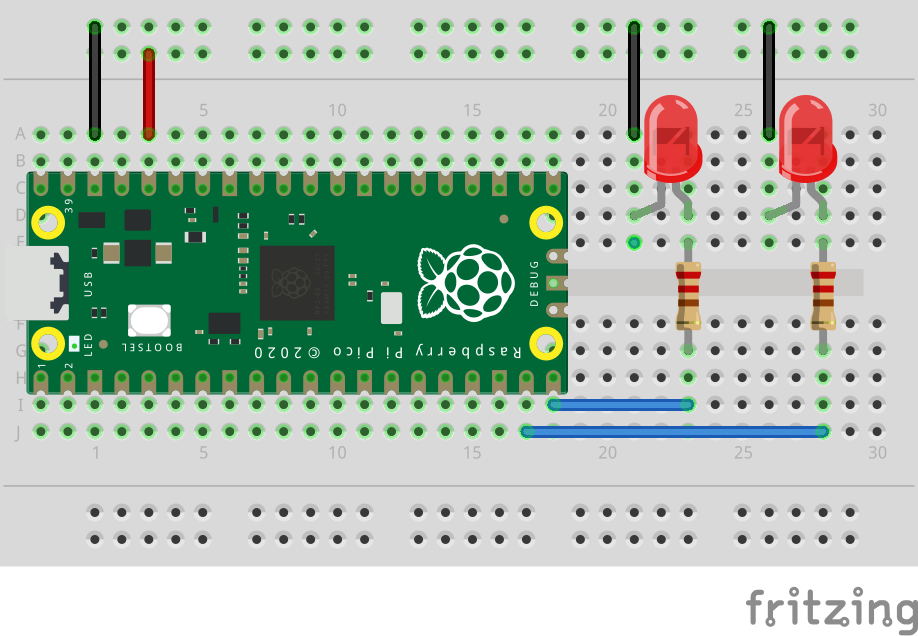

# Blink med to LED-lys

Eksemplet under får to LED-lys til å blinke annenhver gang.



```python
import board
import analogio
import digitalio
import time

led_one = digitalio.DigitalInOut(board.GP14)
led_one.direction = digitalio.Direction.OUTPUT

led_two = digitalio.DigitalInOut(board.GP15)
led_two.direction = digitalio.Direction.OUTPUT

while True:
        led_one.value = True
        led_two.value = False
        time.sleep(0.5)
        
        led_one.value = False
        led_two.value = True
        time.sleep(0.5)
```
