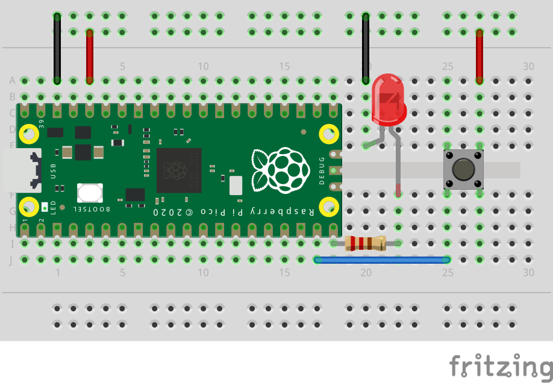

# Skru av og på LED med knapp

Eksemplet under gjør at man kan skru LED-en av og på ved hjelp av en knapp.



```python
import board
import time
from digitalio import DigitalInOut, Direction, Pull

btn = DigitalInOut(board.GP14)
btn.direction = Direction.INPUT
btn.pull = Pull.UP

led = DigitalInOut(board.GP15)
led.direction = Direction.OUTPUT

prev_state = btn.value

while True:
    cur_state = btn.value
    if cur_state != prev_state:
        if cur_state:
            print("BTN is pressed")
            led.value = not led.value

    prev_state = cur_state
    time.sleep(0.1) # Sleep for debounce
```

En utfordring når man bruker knapper på mikrokontrollere er såkalt "debounce". Dette betyr at den mekaniske knappen ikke går umiddelbart fra lavt til høyt signal eller tilbake. Prøv å fjerne `time.sleep(0.1)` fra eksemplet over og se om du merker rar oppførsel.

Les mer om debouncing på: https://learn.adafruit.com/debouncer-library-python-circuitpython-buttons-sensors/overview

Eksemplet under bruker et bibliotek for løse problemet med debouncing. Man må kopiere filene `adafruit_debouncer.py` og `adafruit_ticks.py` til lib-katalogene på diskstasjonen for å kjøre eksemplet. Filene kan lastes ned fra [dette filområdet](lib).

Last ned [biblioteker](button-debounce-libs.zip) og pakk ut i `lib` på CIRCUITPY-disken for å få eksemplet nedenfor til å virke.

```python
import board
import time
from digitalio import DigitalInOut, Direction, Pull
from adafruit_debouncer import Debouncer

btn = DigitalInOut(board.GP14)
btn.direction = Direction.INPUT
btn.pull = Pull.UP
switch = Debouncer(btn)

led = DigitalInOut(board.GP15)
led.direction = Direction.OUTPUT

while True:
    switch.update()

    if switch.rose:
        print('Just released')
        led.value = not led.value
```
