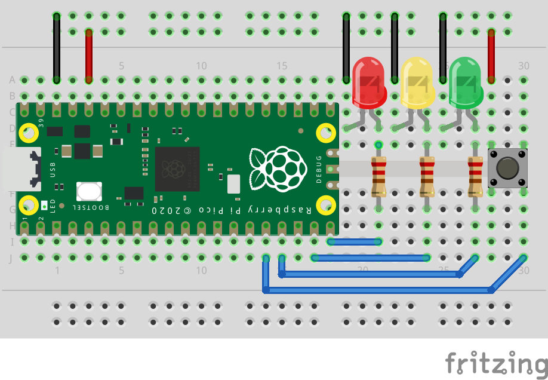

# Trafikklys

Eksemplet under er et trafikklys som går fra rødt, gult til grønt etter man har trykket på en knapp, og så tilbake noen sekunder senere.



```python
import board
import analogio
import digitalio
import time

button = digitalio.DigitalInOut(board.GP12)
button.switch_to_input(pull=digitalio.Pull.DOWN)

green = digitalio.DigitalInOut(board.GP13)
green.direction = digitalio.Direction.OUTPUT

yellow = digitalio.DigitalInOut(board.GP14)
yellow.direction = digitalio.Direction.OUTPUT

red = digitalio.DigitalInOut(board.GP15)
red.direction = digitalio.Direction.OUTPUT

WAIT_SHORT = 1
WAIT_LONG = 5

while True:
    if(button.value):
        time.sleep(WAIT_SHORT)
        red.value = False
        yellow.value = True
        
        time.sleep(WAIT_SHORT)
        yellow.value = False
        green.value = True
        
        time.sleep(WAIT_LONG)
        green.value = False
        yellow.value = True
        
        time.sleep(WAIT_SHORT)
        
    else:
        green.value = False
        yellow.value = False
        red.value = True
```

Kan du forenkle koden ovenfor ved hjelp av funksjoner?
