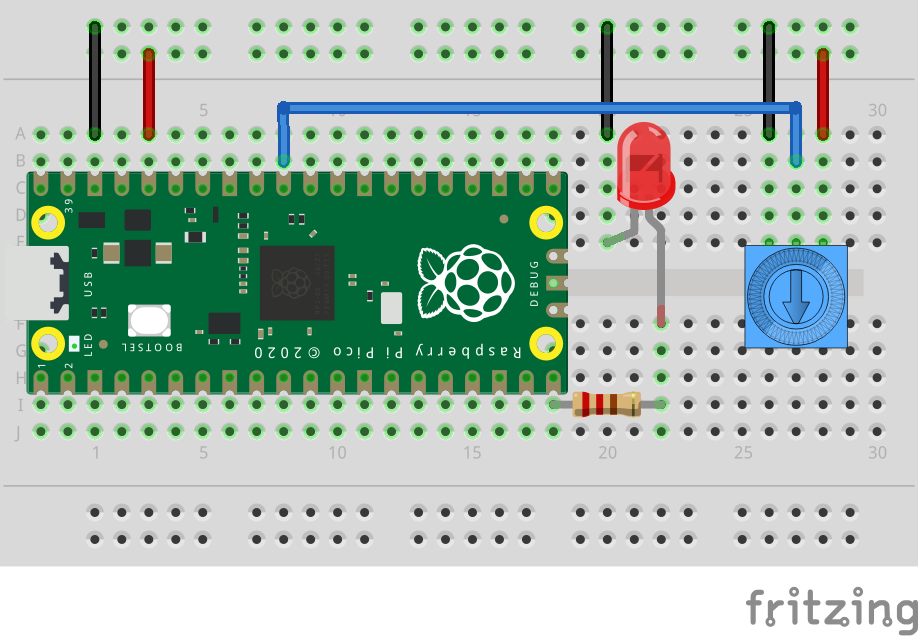

# Python-kurs

## Raspberry Pi Pico


https://learn.adafruit.com/getting-started-with-raspberry-pi-pico-circuitpython

## Komponentsett


## Installer CircuitPyton

Last ned firmware fra: https://circuitpython.org/board/raspberry_pi_pico/

https://learn.adafruit.com/getting-started-with-raspberry-pi-pico-circuitpython/circuitpython

## Installer MU Editor

Last ned fra https://codewith.mu

Les mer på https://learn.adafruit.com/getting-started-with-raspberry-pi-pico-circuitpython/installing-mu-editor

## Oppgaver

### Oppgave 1 - Blinker

Lag et program som får LED-lyset på Raspberry Pi Pico-kortet til å blinke.

```python
import board
import digitalio
import time

led = digitalio.DigitalInOut(board.LED)
led.direction = digitalio.Direction.OUTPUT

while True:
    led.value = True
    time.sleep(0.5)
    led.value = False
    time.sleep(0.5)
```

#### Ekstraoppgave

Endre verdiene på `time.sleep(...)` for å få lysdioden til å blinke saktere eller raskere.

### Oppgave 2 - Blinker med ekstern LED

Koble opp skjemaet og last opp koden for å se at lysdioden blinker.


```python
import board
import digitalio
import time

led = digitalio.DigitalInOut(board.GP15)
led.direction = digitalio.Direction.OUTPUT

while True:
    led.value = True
    time.sleep(0.5)
    led.value = False
    time.sleep(0.5)
```

#### Ekstraoppgave

Koble til en ekstra LED og endre programmeringskoden så begge blinker.

Se [løsningsforslag](assignments/blinky/blinky-two-leds.md) på oppgaven.

### Oppgave 3 - Knapp


```python
import board
import digitalio

led = digitalio.DigitalInOut(board.GP15)
led.direction = digitalio.Direction.OUTPUT
button = digitalio.DigitalInOut(board.GP14)
button.switch_to_input(pull=digitalio.Pull.DOWN)

while True:
    if button.value:
        led.value = True
    
    led.value = False
```

#### Ekstraoppgave 1

Endre programmeringskoden så LED-en skrur seg på med ett klikk på knappen og skrur seg av med et nytt klikk.

Se [løsningsforslag](assignments/button/button-toggle.md) på oppgaven.

#### Ekstraoppgave 2

Lag et trafikklys som går fra rødt, gult til grønt etter man har trykket på en knapp, og så tilbake noen sekunder senere.

Se [løsningsforslag](assignments/button/trafficlight.md) på oppgaven.

### Oppgave 4 - Les analoge signaler

Dette eksemplet viser hvordan man kan lese verdien fra en skru-knapp (potensiometer) ved hjelp av analog inngang på mikrokontrolleren. Åpne serial-konsollet for å se verdiene som blir lest av.

Når man skrur på knappen vil man få et tall på mellom 0 og 65535 (16-bit) ved å skru på Pot-meteret.


Les mer på: https://learn.adafruit.com/circuitpython-libraries-on-any-computer-with-raspberry-pi-pico/adc


```python
import time
import board
import analogio

knob = analogio.AnalogIn(board.A0)

def get_voltage(raw):
    return (raw * 3.3) / 65536

while True:
    raw = knob.value
    volts = get_voltage(raw)
    print("raw = {:5d} volts = {:5.2f}".format(raw, volts))
    time.sleep(0.5)
```

### Oppgave 5 - Pulsbreddemodulering


Les mer: https://learn.adafruit.com/circuitpython-essentials/circuitpython-pwm


```python
import time
import board
import pwmio

led = pwmio.PWMOut(board.GP15, frequency=5000, duty_cycle=0)

while True:
    for i in range(100):
        if i < 50:
            led.duty_cycle = int(i * 2 * 65535 / 100)  # Up
        else:
            led.duty_cycle = 65535 - int((i - 50) * 2 * 65535 / 100)  # Down
        
        print((led.duty_cycle,))  # Open plotter
        time.sleep(0.02)
```

### Oppgave 6 - Dimme LED


Les mer: https://learn.adafruit.com/circuitpython-libraries-on-any-computer-with-raspberry-pi-pico/pwm



```python
import board
import pwmio
import analogio
import time

knob = analogio.AnalogIn(board.A0)

led = pwmio.PWMOut(board.GP15, frequency=1000)

while True:
    led.duty_cycle = knob.value
    print((led.duty_cycle,))  # Open plotter
    time.sleep(0.05)

```

#### Ekstraoppgave

Få en led til å blinke saktere eller fortere ved å vri på en variabel motstand.

Se [løsningsforslag](assignments/adc/blinking-led.md) på oppgaven.

### Oppgave 7 - Les temperatur


Les mer: https://learn.adafruit.com/getting-started-with-raspberry-pi-pico-circuitpython/temperature-gauge

```python
import microcontroller
import time

while(True):
    print((microcontroller.cpu.temperature,))  # Open plotter
    time.sleep(0.5)
```

### Oppgave 8 - NeoPixel (RGB)

### Oppgave 9 - Volumkontroller


Last ned [biblioteker](assignments/volume-controller/volume-controller-libs.zip) og pakk ut i `lib` på CIRCUITPY-disken for å få eksemplet nedenfor til å virke.

```python
import board
from digitalio import DigitalInOut, Direction, Pull
from adafruit_debouncer import Debouncer
import usb_hid
from adafruit_hid.consumer_control import ConsumerControl
from adafruit_hid.consumer_control_code import ConsumerControlCode
import time

button_one = DigitalInOut(board.GP15)
button_one.direction = Direction.INPUT
button_one.pull = Pull.UP
volume_up = Debouncer(button_one)

button_two = DigitalInOut(board.GP14)
button_two.direction = Direction.INPUT
button_two.pull = Pull.UP
volume_down = Debouncer(button_two)

cc = ConsumerControl(usb_hid.devices)

while True:
    volume_up.update()
    volume_down.update()
    
    if volume_up.fell:
        print('Volume up pressed')
        cc.press(ConsumerControlCode.VOLUME_INCREMENT)
    
    if volume_up.rose:
        print('Volume up released')
        cc.release()
    
    if volume_down.fell:
        print('Volume down pressed')
        cc.press(ConsumerControlCode.VOLUME_DECREMENT)
    
    if volume_down.rose:
        print('Volume down released')
        cc.release()
```
